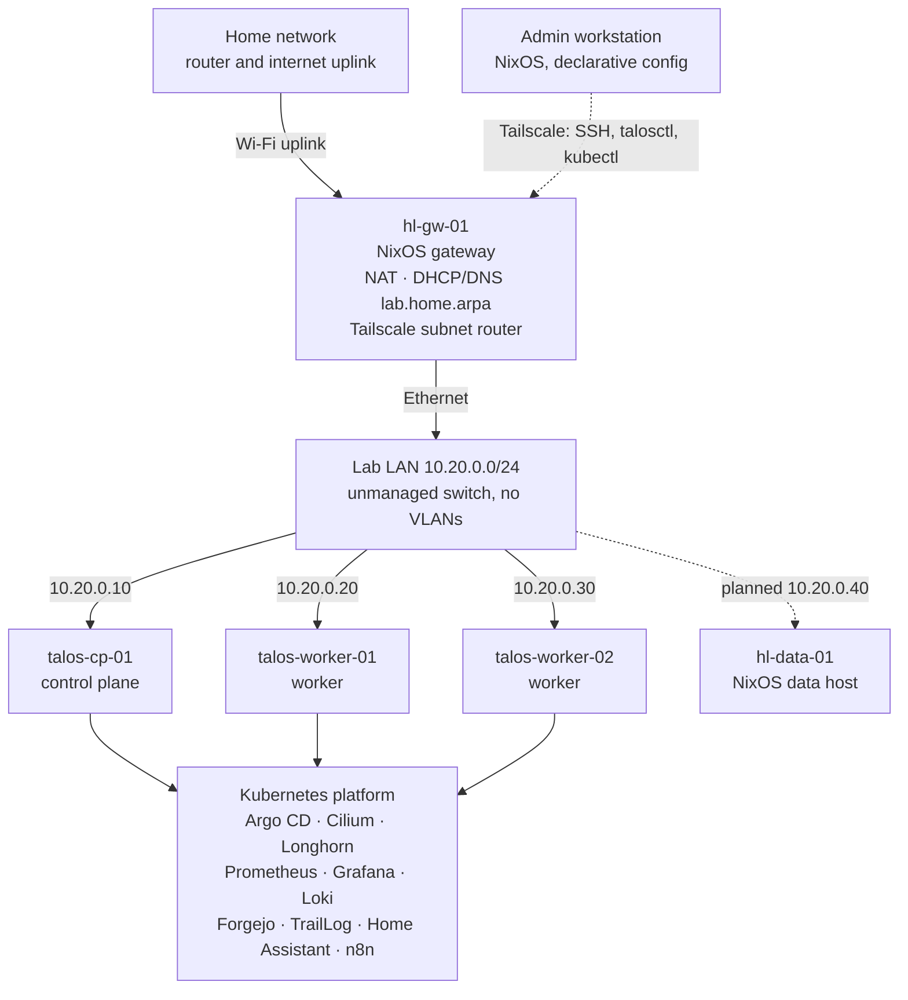

# Topology

```mermaid
flowchart TD
    home["Home network<br/>router and internet uplink"] -->|Wi-Fi uplink| gw["hl-gw-01<br/>NixOS gateway<br/>NAT · DHCP/DNS lab.home.arpa<br/>Tailscale subnet router"]
    gw -->|Ethernet| switch["Lab LAN 10.20.0.0/24<br/>unmanaged switch, no VLANs"]
    switch -->|10.20.0.10| cp["talos-cp-01<br/>control plane"]
    switch -->|10.20.0.20| w1["talos-worker-01<br/>worker"]
    switch -->|10.20.0.30| w2["talos-worker-02<br/>worker"]
    switch -.->|planned 10.20.0.40| data["hl-data-01<br/>NixOS data host"]

    cp --> k8s["Kubernetes platform<br/>Argo CD · Cilium · Longhorn<br/>Prometheus · Grafana · Loki<br/>Forgejo · TrailLog · Home Assistant · n8n"]
    w1 --> k8s
    w2 --> k8s

    laptop["Admin workstation<br/>NixOS, declarative config"] -.->|Tailscale: SSH, talosctl, kubectl| gw
```

The admin workstation is configured in a separate Nix repository, so the client side of access (SSH config, Tailscale, tooling versions) is as reproducible as the servers.
